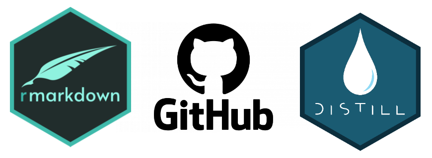

```{r setup, include=FALSE}
knitr::opts_chunk$set(echo = FALSE)
```
<style>
  .blackbox {
    padding: 1em;
    background: #b0c4cf;
    color: black;
    border: 2px solid #455a64;
    border-radius: 7px;
  }
</style>



## 2.1 R Markdown and Distill

### R Markdown

What is R Markdown? [R Markdown](https://rmarkdown.rstudio.com/index.html) is a framework to create documents in R. One main reason to use R Markdown is to share your R analyses in a reproducible and dynamic report. Many researchers create an R Markdown document to accompany their publications, in order to promote open data and transparent reporting.

:::: {.blackbox data-latex=""}
**Watch the 1-minute video <a href="https://vimeo.com/178485416">What is R Markdown?</a> from <a href="https://vimeo.com/rstudioinc">RStudio, Inc.</a> on <a href="https://vimeo.com">Vimeo</a> for a quick explanation on R Markdown.**
::::  

</p><iframe src="https://player.vimeo.com/video/178485416?h=8a57bf9b88&color=428bca" width="640" height="400" frameborder="0" allow="autoplay; fullscreen; picture-in-picture" allowfullscreen></iframe>

### Distill

What is Distill? [Distill](https://rstudio.github.io/distill/) is a web publishing format specifically created for R Markdown documents. This is one of the simplest ways to turn your R Markdown documents into (pre)webpages. There many different formats (i.e., Hugo, bookdown), but Distill is a very stable format which require less maintenance and is easy to learn.

:::: {.blackbox data-latex=""}
**Read [this article](https://rstudio.github.io/distill/website.html) on how to create a website in Distill.**
::::  

## 2.3 GitHub

What is Github? [GitHub](https://github.com/) is a platform to store, track, and collaborate on software projects. In our [CDS Hackathon events](https://psychologie.unibas.ch/de/fakultaet/abteilungen/cognitive-and-decision-sciences-305/events/), we use GitHub to jointly work on a data analytic project.

:::: {.blackbox data-latex=""}
**Watch the 3-minute video <a href="https://www.youtube.com/embed/w3jLJU7DT5E">What is GitHub?</a> from <a href="https://www.youtube.com/c/GitHub">GitHub</a> on <a href="https://youtube.com">Youtube</a> for a quick explanation on R Markdown.**
::::  

</p><iframe width="560" height="315" src="https://www.youtube.com/embed/w3jLJU7DT5E" title="YouTube video player" frameborder="0" allow="accelerometer; autoplay; clipboard-write; encrypted-media; gyroscope; picture-in-picture" allowfullscreen></iframe>


### Assignment

Your assignment is to **create your own website on R Markdown using Distill and host it on GitHub.** Creating the basic website will take you less than an hour, but personalizing it will take you longer. **Give yourself an additional 10-20 hours** to complete your website according to the requirements below. We expect you to have your website ready for the midterm meeting with your supervisor. 

#### Step 1: Installations

  1. Install the the following packages in RStudio:
  
```{r, eval=FALSE, echo=TRUE}
install.packages(c("distill", "rmarkdown", "postcards"))
```  
  
  2. [Create a GitHub account](https://github.com/join)
  3. [Install GitHub Desktop](https://desktop.github.com/)

#### Step 2: Setting Up

Create your basic website template by following the instructions on our [BEACON 2022 Workshop website](https://matarui.github.io/beacon/instructions.html). Make sure to create your website with **Version 2**. 

#### Step 3: Personalization

Personalize your website! Your website should contain the following pages:

  1. A **landing page**: Include *author, published date, an introductory text, and a photo related to your website.*
  2. An **about me page**: Include *your photo, a text about you, and a few links of your choice (i.e., Email, LinkedIn).*
  **Tip 1:** This [article](https://www.apreshill.com/blog/2020-12-postcards-distill/) from [Alison Hill](https://www.apreshill.com/) has great step-by-step details on how to make postcards.
  3. A **project page**: Include *a description of your project, a table* using the knitr's `kable` function and *a plot* using `ggplot2`.
  **Tip 2:** Check out [this chapter](https://r4ds.had.co.nz/r-markdown.html) on R Markdown in [R for Data Science](https://r4ds.had.co.nz/index.html). They use other formats to process and publish, but they have a great explanation and some exercises as well!
  4. A **footer** and a **table of contents** on each page.
  
Feel free to add any customizations you want on your website. You can play around with changing the template (i.e., changing themes) or adding emojis :smiley:. 

**Tip 3:** Download the [R Markdown Cheatsheet](resources/2_session1/rmarkdown_cheatsheet.pdf) for an overview of commands!