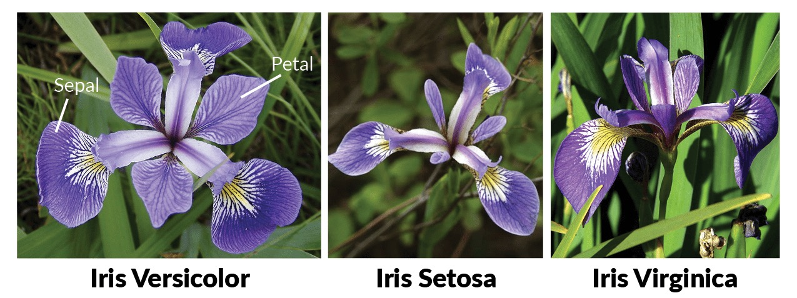

```{r setup, include=FALSE}
knitr::opts_chunk$set(echo = FALSE)
```
<style>
  .blackbox {
    padding: 1em;
    background: #b0c4cf;
    color: black;
    border: 2px solid #455a64;
    border-radius: 7px;
  }
</style>

## Swirl

For this session, you will learn how to run regressions with the interactive course from [`swirl()`](https://swirlstats.com/).

```{r, eval=FALSE, echo=TRUE}
install.packages("swirl")
library(swirl)
```  
Choose module `2: Regression Models: The basics of regression modeling in R`.

There are 13 Topics in Regression! Each Topic takes around 15 minutes. Start with the **Introduction**.


### Assignment

In this part, your assignment is to pratice some regression tasks. We expect you to be familar with regression model in R and can use it confidently.

#### Task 1: Creating a linear model in R

  1. Downloading of the data is trivial today, as we will use a built-in dataset called iris
  
```{r, eval=TRUE, echo=TRUE}
iris <- iris
head(iris)
```  

Here is an illustration of the variables
(image source: https://www.datacamp.com/community/tutorials/machine-learning-in-r):


  2. Creating a linear model to explore the relationship between *Sepal.Length* and *Petal.Length*
  3. Understanding the result of a linear fit
  4. Visualizing the linear fit
  
#### Task 2: Creating  a multiple linear regression
  1. Add *Species* to the model from before, exploring the relationship between *Sepal.Length* and *Petal.Length* for different *Species*
  2. Understanding the result of a linear fit
  3. Visualizing the multiple linear fit
