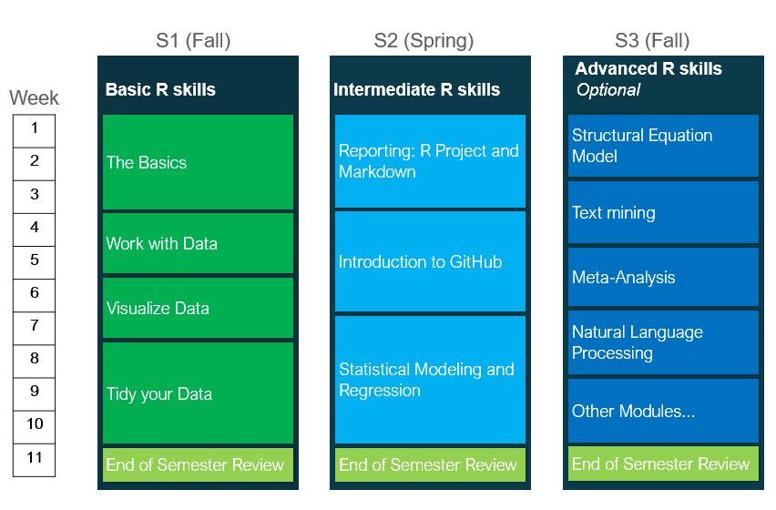

```{r setup, include=FALSE}
knitr::opts_chunk$set(echo = FALSE)

# Learn more about creating websites with Distill at:
# https://rstudio.github.io/distill/website.html

# Learn more about publishing to GitHub Pages at:
# https://rstudio.github.io/distill/publish_website.html#github-pages

# rmarkdown::render_site()
```




## S1 (Fall): Basic R skills

For the first semester (S1 Fall), there are 11 topics for four modules in this R training. For each topic, we have compiled different online materials for you to go through, as well as assignments for you to test your skills. This program is largely based on the great online tutorials from RStudio called [Primers](https://rstudio.cloud/learn/primers). This training is a self-guided learning, which allows you to engage with the material at your own pace and at times that suit you the most. These topics will help you acquire basic skills in R, which will be most useful in the upcoming CDS Hackathons. 

Each session takes around 1-2 hours. The deadline to complete all sessions is by XXX, where you will have a meeting with our CDS team members to review and discuss your progress. For any questions, please write XXX

Please note that this site is *work-in-progress* and will be updated throughout the HS21 semester.


::: l-body
| # | Modul     | Topic                         | Slides |
|---| ---------|-------------------------------|--------|
| 1 | The Basics | [Introduction](session1.html) | [pdf](index.html) |
| 2 | The Basics | [Visualization Basics](session2.html) | [pdf](index.html) |
| 3 | The Basics | [Programming Basics](session3.html) | [pdf](index.html) |
| 4 | Work with Data | [Working with Tibbles/Isolating Data with dplyr](session4.html) |  |
| 5 | Work with Data | [Derive Information with dplyr](session5.html) |  |
| 6 | Visualize Data | [Exploratory Data Analysis](session6.html) | [pdf](index.html) |
| 7 | Visualize Data | [Charts and Plots](session2.html) | [pdf](index.html) |
| 8 | Tidy your Data | [Reshape Data](session3.html) | [pdf](index.html) |
| 9 | Tidy your Data | [Separate and Unite Columns](session4.html) | [pdf](index.html) |
| 10 | Tidy your Data | [Join Data Sets](session5.html) |  |
| 11 | Tidy your Data | [Long and Wide Format with tidyr](session2.html) | [pdf](index.html) |
| 12 | Review | [Review and Meeting with CDS Team](session6.html) |  |

:::

## Tips to getting started

Learning R can be challenging, but ultimately rewarding! Below are some of tips to get you through the learning process easier.

**Use the help function**
The help function in R can help you understand how the function works or what it is doing. You can go to the 'help' tab in the viewer pane and type the name of the function its search tab. Note: only functions in the currently loaded packages will show up, so make sure you have the package with the function of interest loaded with the command 'library(packagename)'. You can also type ?functionname into the console (e.g. ?mean). Every function has documentation, and this command will bring it up. If you don't know the exact function name, you can also type ??thingIamlooking (e.g. ??mean) to perform a search for related documentation. See [this page](https://www.r-project.org/help.html) for how to get help in R.

**Search in forums**
There are many forums such as [stackoverflow.com](https://stackoverflow.com/) or [stackexchange.com](https://stackexchange.com/) where many people ask questions on R. It is most likely that someone has already asked a question that you have on one of these forums and have provided detailed answers. 

**Discuss with other students**
There are many different ways of solving a problem in R. Chances are that a new, easier solution that you have not thought about emerges from discussing with others. Connect with your fellow students and don't hesitate to work in groups as well as asking those in higher semesters for help!


## Useful Links and Resources

The internet is full of resources for learning R. Below are few of the most helpful links to support you with your learning. 

[**R for Data Science**](https://r4ds.had.co.nz/index.html)
This online book has great explanations and codes to many of the topics that you will be going through in the R training. It offers in-depth explanations to R as well as to individual functions. 

[**YaRrr! The Pirate’s Guide to R**](https://bookdown.org/ndphillips/YaRrr/)
This is another great online book to get you started in R. This book also contains great explanations to R as well as guides to conducting different hypothesis tests such as t-tests, ANOVA and regressions.

[**Introduction to Tidyverse**](https://brianward1428.medium.com/introduction-to-tidyverse-7b3dbf2337d5)
Tidyverse is a set of R packages that share a common 'style'. Tidyverse is a neat, clean and easy style of using R that will help you write even more beautiful code in R. This is also the coding style that we will be using again and again in this training program. Check out Brian Ward's practical introduction to the most essential functions of Tidyverse.

[**Datacamp**](https://www.datacamp.com/courses/free-introduction-to-r)
Datacamp is an online learning platform for Data Science. They offer many hands-on lessons and tutorials in R. If you need a little refresher in R, we recommend that you go through the free course [Introduction to R](https://learn.datacamp.com/courses/free-introduction-to-r) in Datacamp.

[**RStudio Cheatsheets**](https://www.rstudio.com/resources/cheatsheets/)
It would be impossible to learn all the different functions in R by heart, and nobody expects you to have these all in memory :) Cheatsheets are a great way to have an overview of the most basic functions and will make your life (with R) much easier.