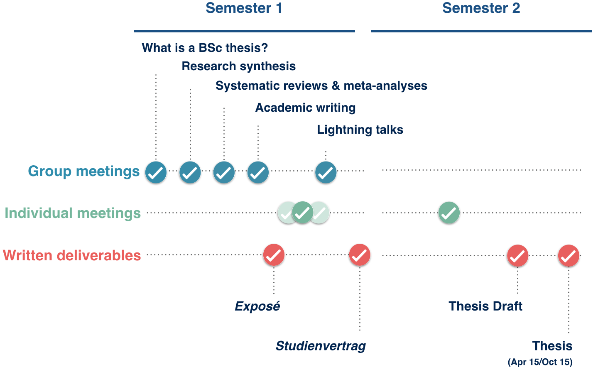

```{r setup, include=FALSE}
knitr::opts_chunk$set(echo = FALSE)

# Learn more about creating websites with Distill at:
# https://rstudio.github.io/distill/website.html

# Learn more about publishing to GitHub Pages at:
# https://rstudio.github.io/distill/publish_website.html#github-pages

```




## Writing a BSc thesis made easy(er)!

This website helps you get an overview of the steps involved in writing a bachelor thesis. It makes available readings and other resources to help you write a BSc thesis consisting of a research synthesis (e.g., systematic review, rapid review, scoping review). The slides for each session will also be posted here (after each session).

Before the start of the semester please take some time to read the [FAQs](https://matarui.github.io/BSc_thesis/index.html#frequently-asked-questions) below and the Faculty of Psychology's [page](https://psychologie.unibas.ch/de/studium/bachelorstudium/zweites-und-drittes-studienjahr/bachelorarbeit-4190/) on writing a bachelor thesis.

Please note that this site is *work-in-progress* and will be updated on a regular basis throughout the HS21 semester.

Sessions take place Tuesdays, **8.15-9.45** over Zoom (link will be made available over email). 

::: l-body
| # | Date     | Topic                         | Slides |
|---| ---------|-------------------------------|--------|
| 1 | 21.09.2021 | [What is a BSc thesis?](session1.html) | [pdf](index.html) |
| 2 | 28.09.2021 | [Research Synthesis](session2.html) | [pdf](index.html) |
| 3 | 19.10.2021 | [Systematic Reviews and Meta-analyses](session3.html) | [pdf](index.html) |
| 4 | 02.11.2021 | [Academic Writing](session4.html) | [pdf](index.html) |
| 5 | 8.11-19.11 2021 | [Individual Meetings](session5.html) |  |
| 6 | 23.11 & 30.11 2021 | [Student Lightning Talks](session6.html) |  |
:::

# Frequently Asked Questions

**Q: Is it mandatory to attend these sessions? **

Yes. Attendance is mandatory for students assigned to writing their bachelor thesis with the Center for Cognitive and Decision Sciences through the [BachelorMatch](https://admin.psycho.unibas.ch/?content=registration&detail=viewthemen) system.

**Q: Do I need to register for a specific course to attend these sessions? **

No. Students are assigned to writing their bachelor thesis with the Center for Cognitive and Decision Sciences through the [BachelorMatch](https://admin.psycho.unibas.ch/?content=registration&detail=viewthemen) system and do not need to register for any additional course(s). 

**Q: Do I receive credit points for attending these sessions? **

No. Students receive credits upon completion of the thesis but not for thesis preparation. 

**Q: Do I need to conduct a meta-analysis for my BSc thesis? **

No. Students writing their bachelor thesis with the Center for Cognitive and Decision Sciences are encouraged to write a research synthesis (i.e., some form of combining the results of multiple studies to answer a research question) but this may not necessarily involve a meta-analysis as there are various forms of research synthesis (e.g., systematic reviews, rapid reviews, scoping reviews) that may not involve a meta-analysis. Each student is encouraged to select the form of research synthesis that best suits their research question. In addition, students have additional options, for example, writing an empirical bachelor thesis based on secondary data-analysis using existing, publicly available data - such alternative plans need to be discussed with the instructor on a case-by-case basis. 

**Q: Do I need to write a thesis on the topic that was selected by BachelorMatch? **

No. The [BachelorMatch](https://admin.psycho.unibas.ch/?content=registration&detail=viewthemen) system assigns students to projects and students can choose to pursue the topic assigned to them. However, students can also pursue different topics and are encouraged to discuss topic feasibility with the instructor. The instructor will also propose topics that are directly related to the core scientific interests of the Center for Cognitive Decision Sciences during the first session. Check out our [website](http://www.cds.unibas.ch) to learn more about the work at the center.  

**Q: Can I write a thesis on any topic? **

Yes, within reason. Some topics may be difficult to pursue because there are too few primary studies available or require methodology and skills that are not feasible to acquire in the context of a bachelor thesis. Students are encouraged to discuss topic feasibility with the instructor. 

**Q: Do I need to write a thesis proposal (Exposé)? **

Yes. Students are required to write a draft thesis proposal of 1-2 pages as preparation for their individual meeting with the instructor. The thesis proposal will then be used as an appendix to the [study contract](https://psychologie.unibas.ch/fileadmin/user_upload/psychologie/Studium/Bachelorstudium/Dokumente/Studienvertrag_BA.docx) that needs to be submitted by the end of the semester (typically around the last week of the Fall semester). 

**Q: Do I need to write my thesis in English? **

No. The sessions listed above will take place in English but individual meetings and thesis writing can take place in German.

**Q: How will my bachelor thesis be evaluated? **

There are a number of criteria, including the clarity and quality of argumentation, effort, and the use of appropriate methods and procedures. An example of the thesis evaluation sheet can be found [here](resources/CDS_EvaluationForm.pdf).

**Q: How many studies should a research synthesis include? **

A synthesis needs to include, by definition, more than one study - there is no clear rule for a minimum number of studies. 

**Q: How many pages should my thesis have? **

Less is more: Shorter, clear writing should be preferred. A bachelor thesis is formatted like a scientific manuscript and will typically be about 20-30 pages in length (including references, tables, and figures, but excluding appendices). 

**Q: What formal criteria does my thesis need to comply with? **

The thesis needs to comply with APA formatting. It must **comply with** and include a *declaration of scientific integrity*: "The author hereby declares that she/he has read and fully adhered to the [Code for Good Practice in Research of the University of Basel](https://psychologie.unibas.ch/fileadmin/user_upload/psychologie/Studium/Bachelorstudium/Dokumente/Code_of_good_practice_in_research.pdf)." 

**Q: Should I use a template? **

Yes. Please use the [template](https://psychologie.unibas.ch/fileadmin/user_upload/psychologie/Studium/Bachelorstudium/Dokumente/BAchelor_thesis_vorlage.doc) provided by the deanery of studies. 

**Q: How do I submit my thesis? **

Bachelor thesis should be emailed to [studiendekanat-psychologie@unibas.ch](mailto:studiendekanat-psychologie@unibas.ch). 

**Q: When is my thesis due? **

Bachelor thesis are due April 15th. You can apply for an extension for sickness or other reasons **after** discussing this with the instructor and sending the appropriate [form](https://psychologie.unibas.ch/fileadmin/user_upload/psychologie/Studium/Bachelorstudium/Dokumente/Mitteilung_Verlaengerung_Abgabetermin_BA_neu.doc) to [pruefungskommission-psychologie@unibas.ch](mailto:pruefungskommission-psychologie@unibas.ch). 

**Q: How often should I meet the instructor?**

You should meet the instructor several times in the group meetings and *at least* once for an individual meeting. More meetings are possible and typically needed, with most students meeting the instructor 2-3 times before signing the *Studienvertrag*. Feel free to email the instructor with a meeting request but please make sure to include in your email a list of specific questions and background materials (papers, expose) that you would like to discuss.
