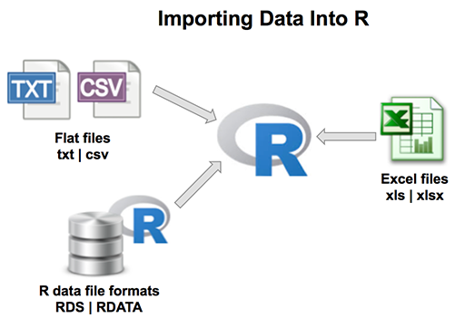

```{r setup, include=FALSE}
knitr::opts_chunk$set(echo = FALSE)
```
<style>
  .blackbox {
    padding: 1em;
    background: #b0c4cf;
    color: black;
    border: 2px solid #455a64;
    border-radius: 7px;
  }
</style>

## 1.1 Getting Started

We assume that you all have some degree of experience with R in your bachelor studies. However, if you are completely new to R or if you haven't used R for a long time, we recommend that you watch these videos as a refresher. 

**Introduction to RStudio from MarinStats**
<iframe width="560" height="315" src="https://www.youtube.com/embed/riONFzJdXcs" title="YouTube video player" frameborder="0" allow="accelerometer; autoplay; clipboard-write; encrypted-media; gyroscope; picture-in-picture" allowfullscreen></iframe>

**Download and Install R & RStudio from MarinStats**
<iframe width="560" height="315" src="https://www.youtube.com/embed/cX532N_XLIs" title="YouTube video player" frameborder="0" allow="accelerometer; autoplay; clipboard-write; encrypted-media; gyroscope; picture-in-picture" allowfullscreen></iframe>

**Simple Arithmetic in R from MarinStats**
<iframe width="560" height="315" src="https://www.youtube.com/embed/UYclmg1_KLk" title="YouTube video player" frameborder="0" allow="accelerometer; autoplay; clipboard-write; encrypted-media; gyroscope; picture-in-picture" allowfullscreen></iframe>


## 1.2 Importing and Exporting Data
[](http://www.sthda.com/english/wiki/importing-data-into-r)

One of the most common, beginner problems that we run into is *loading the data in R.* Most of these problems arise because there are different functions we need to use for different file types.  

:::: {.blackbox data-latex=""}
**Read [this chapter](http://www.sthda.com/english/wiki/importing-data-into-r) from the STHDA wiki page on Importing Data into R**, which provides an excellent overview of the different functions to import data from txt, csv and Excel into R and also explanations on how to use them.
::::
<p>&nbsp;</p>

**Tip 1:** Focus on the chapters *Fast Reading of Data From txt|csv Files into R: readr package* and *Reading data From Excel Files (xls|xlsx) into R*, as these are the most common data files that you will be encountering throughout your R journey!

**Tip 2:** Use the Cheatsheets! They are a great way of quickly looking for a function you need. Click [here](resources/session1/data-import.pdf) to download the the cheatsheet for *Data Import with readr*.


### Assignment

We have uploaded a file on Github called *Tourismus*, which is a data set from Basel City on Tourism from foreign countries. 
  
  1. Create a new data set called **tourismus** by reading in the data on our Github page using this url: https://raw.githubusercontent.com/cdsbasel/rtraining/main/data/Tourismus.csv
  
  2. Inspect the dataset and answer the questions using functions. What does each column show? How many rows are there? Which country had the highest number of tourists? *Note.* If you get stuck or don't know where to start, make sure to look at the *Useful Links and Resources* that we have compiled for you, which you can find on the homepage.


``` {r echo = F, results = 'hide'}
### Solution
library(tidyverse)
# read file from url
tourismus <- read_csv("https://raw.githubusercontent.com/cdsbasel/rtraining/main/data/Tourismus.csv")

# inspect dataset
glimpse(tourismus)  
summary(tourismus)  
tourismus %>% slice_max(Besucher)
```