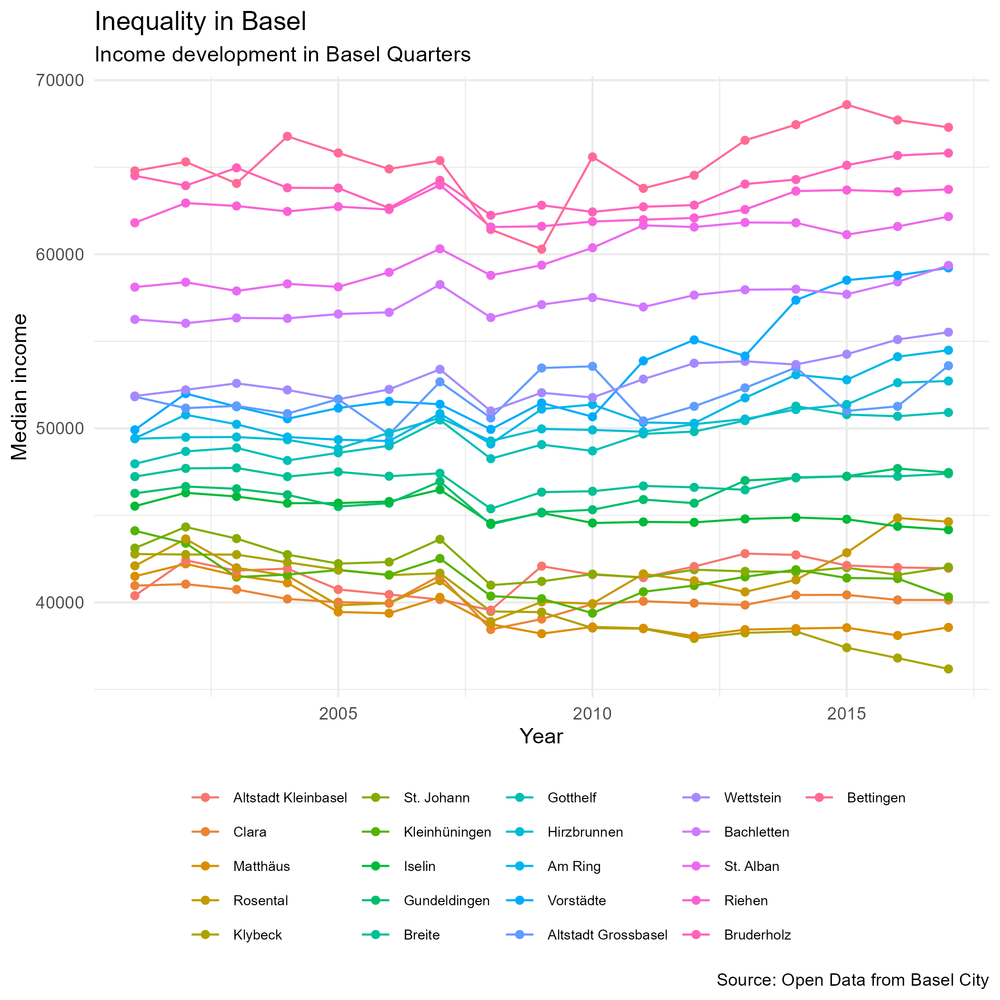

```{r setup, include=FALSE}
knitr::opts_chunk$set(echo = FALSE)
```
<style>
  .blackbox {
    padding: 1em;
    background: #b0c4cf;
    color: black;
    border: 2px solid #455a64;
    border-radius: 7px;
  }
</style>

## 2.1 Understanding ggplot2

There are many ways to Rome, and there are many ways to create a graphic using different packages and function in R. :)

We will be focusing on [ggplot2](https://ggplot2.tidyverse.org/), a package part of the tidyverse, which is great in creating beautiful graphics. You provide the data, tell ggplot2 how to map variables to aesthetics, what graphical primitives to use, and it takes care of the details. 

:::: {.blackbox data-latex=""}
**Go through the RStudio Primer on [Data Visualization Basics](https://rstudio.cloud/learn/primers/1.1)** and **complete the assignments below.**
::::
<p>&nbsp;</p>

**Tip 1:** Again, cheatsheets will make your (R) life easy! Click [here](resources/session1/data-visualization-2.1.pdf) to download the cheatsheet for *Data Visualization with ggplot2*.

**Tip 2:** Check out the [R graph gallery](https://www.r-graph-gallery.com/) for an example of graphics and code.

### Assignment

In our Github page, there is a data called *taxation*, which is data from Basel on income and inequality. 

  1. Create a data set called **taxation** using the file on our Github page. This time, download the data on your computer and read it in R locally. Click [this link](https://github.com/cdsbasel/rtraining/tree/main/data) to access the folder.

  2. Create a plot using this data set. Make a plot with year and a variable of interest (e.g. Median Income), and show the different quarters. Include a title, subtitle, legend, and rename the axis labs. 
  
  3. Save the plot as a png. 
  
Below is an example of a plot showing the median income of the quarters by year. *Note.* If you want to control the order of the discrete variables, you need to know some wrangling. Although you will learn about these functions in later sessions, you can already try to sort the variable "quarter" with `arrange(year, yourvariableofinterest)` and turn it into a factor with `mutate(quarter = as_factor(quarter))`.
  

  

### Solution
``` {r echo = T, results = 'hide'}
library(tidyverse)
taxation <- read_csv("data/taxation.csv")

# make plot as 'my_plot'
my_plot <- taxation %>%
  arrange(year, income_median) %>%
  mutate(quarter = as_factor(quarter)) %>%
  ggplot(aes(x = year, 
           y = income_median, 
           col = quarter)) +
  geom_line() + 
  geom_point() +
  theme_minimal() +
  theme(
    legend.position = "bottom",
    legend.title = element_blank(),
    # reduce legend text size
    legend.text = element_text(size = 7)) +
  labs(x = "Year",
     y = "Median income",
     title = "Inequality in Basel",
     subtitle = "Income development in Basel Quarters",
     caption = "Source: Open Data from Basel City")

# save plot
ggsave(filename = "inequality_basel.png",
       plot = my_plot,
       device = "png",
       path = "resources/session2",
       width = 7, 
       height = 7)
```