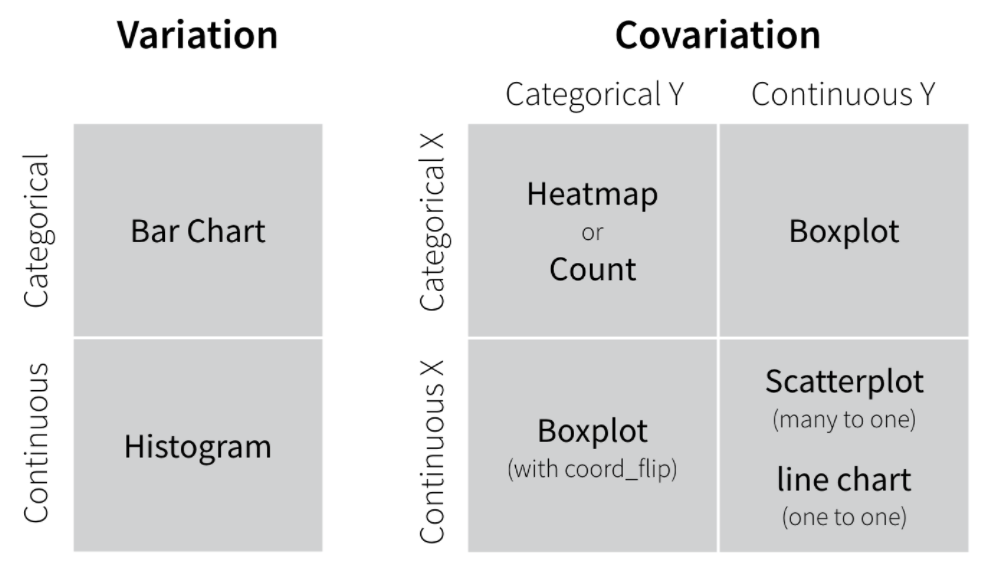

```{r setup, include=FALSE}
knitr::opts_chunk$set(echo = FALSE)
```

## 6.1 Explore your data


In this module, you will learn how to use `ggplot2` to visualize patterns within values and relationships between variables. You will first learn **Exploratory data analysis** or **EDA**, a way to use visualization and transformation to explore your data systematically.

**Go through the RStudio Primer 3.1 on [Exploratory Data Analysis](https://rstudio.cloud/learn/primers/3.1)** and **think about possible graphics** that you can employ for EDA in your own master project. 

There are **no additional assignments** for this session.


