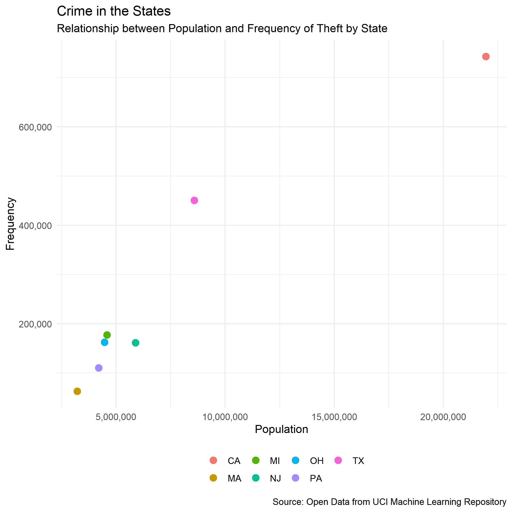

```{r setup, include=FALSE}
knitr::opts_chunk$set(echo = FALSE)
```
<style>
  .blackbox {
    padding: 1em;
    background: #b0c4cf;
    color: black;
    border: 2px solid #455a64;
    border-radius: 7px;
  }
</style>

## 7.1 Making graphics

In the previous session, you learned how you can systematically explore your data and which questions to ask in order to determine the best visualizations for your data. In this session, you will learn about the individual charts and plots and how to make them.

:::: {.blackbox data-latex=""}
**Go through the following RStudio Primers:**

- [**Bar charts**](https://rstudio.cloud/learn/primers/3.2)
- [**Histograms**](https://rstudio.cloud/learn/primers/3.3) 
- [**Boxplots and Counts**](https://rstudio.cloud/learn/primers/3.4)
- [**Scatterplots**](https://rstudio.cloud/learn/primers/3.5)
- [**Line Plots**](https://rstudio.cloud/learn/primers/3.6)
- [**Overplotting and Big Data**](https://rstudio.cloud/learn/primers/3.7)
- [**Customize Your Plots**](https://rstudio.cloud/learn/primers/3.8)
::::

### Assignment

Download and read the **verbrechen** data from [our Github page](https://github.com/cdsbasel/rtraining/tree/main/data), or read it directly using this url: https://raw.githubusercontent.com/cdsbasel/rtraining/main/data/verbrechen.csv

  1. Look at the data using the functions that you have learned in the previous sessions to get a general idea of the variables. You can use e.g. `group_by(), summarize() and filter()`. Some ideas for questions are: What is the minimum, mean and maximum number of `verbrechen` by state? What type of `verbrechen` is the most common type?
  
  2. Make a Scatterplot between `bevoelkerung` and a type of crime of your choice. Adjust the colour or shape of the dots to show the different states or counties. You will have to use the functions mentioned above to first manipulate your data.
  
  **Tip 1:** To show the thousand separators in the axis labels, add `scale_y_continuous(labels = comma) + scale_x_continuous(labels = comma)`. For the comma label, you will first need to install the package `scales`.
  
Here is an example of a scatterplot:
  


**Tip 2:** Of course, there is a ggplot2 cheatsheet for [*Data Visualization*](resources/session7/data-visualization-2.1.pdf) as well :)

### Solution
```{r echo = T, results = 'hide'}
library(tidyverse)
library(scales) # to later add commas to the axis numbers
verbrechen <- read_csv("data/verbrechen.csv")

# for axis numbers
options(scipen=10000)

# make plot as 'my_plot'
my_plot <- verbrechen %>%
  filter(verbrechen == "diebstahl" ) %>%
  group_by(staat) %>%
  summarise(sum = sum(haeufigkeit),
            population = sum(bevoelkerung)) %>%
  ggplot(aes(x = population, 
             y = sum, 
             col = staat)) +
  geom_point(size = 3) +
  theme_minimal() +
  theme(
    legend.position = "bottom",
    legend.title = element_blank(),
    # reduce legend text size
    legend.text = element_text(size = 9)) +
  labs(x = "Population",
       y = "Frequency",
       title = "Crime in the States",
       subtitle = "Relationship between Population and Frequency of Theft by State",
       caption = "Source: Open Data from UCI Machine Learning Repository") +
  scale_y_continuous(labels = comma) +
  scale_x_continuous(labels = comma)
```
