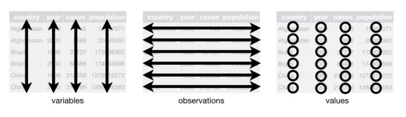

```{r setup, include=FALSE}
knitr::opts_chunk$set(echo = FALSE)
```

### 8.1 Tidying data


In order to work with your data more efficiently, you should store it as a *tidydata* In tidy data, each variable forms a **column**, and each observation forms a **row.** This is *crucial* for data manipulation, visualization and further analyses. If you keep all your data tidy, you will not have to spend hours transforming one format of data into another, in order to run analyses or to make graphics in R. 

In the last 4 sessions, you will learn how to tidy your data with ease. For this session, you will familiarize yourself with the functions `gather()` and `spread()`, with which you can manipulate the layout of your data set. 

**Go through the RStudio Primer 4.1 [**Reshape Data**](https://rstudio.cloud/learn/primers/4.1).**
  
**Tip 1:** The cheatsheet [*Data Wrangling with dplyr and tidyr*](resources/session8/data-wrangling.pdf) has visual examples of what the tidying functions do to the data set, which will be of use in these last sessions. 


